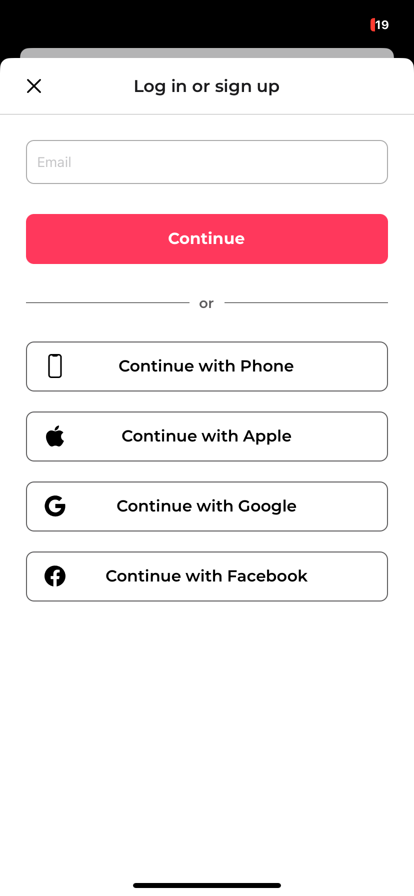
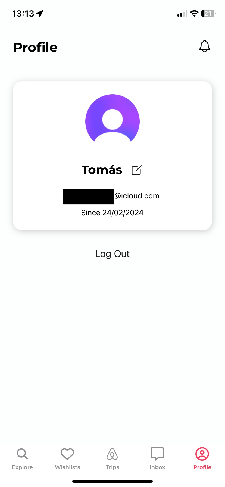
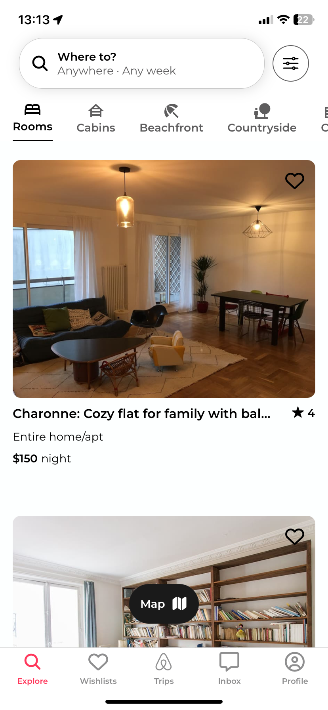
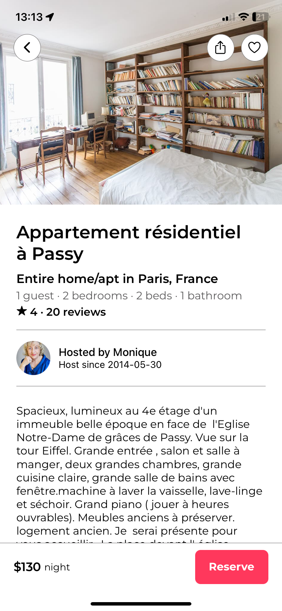
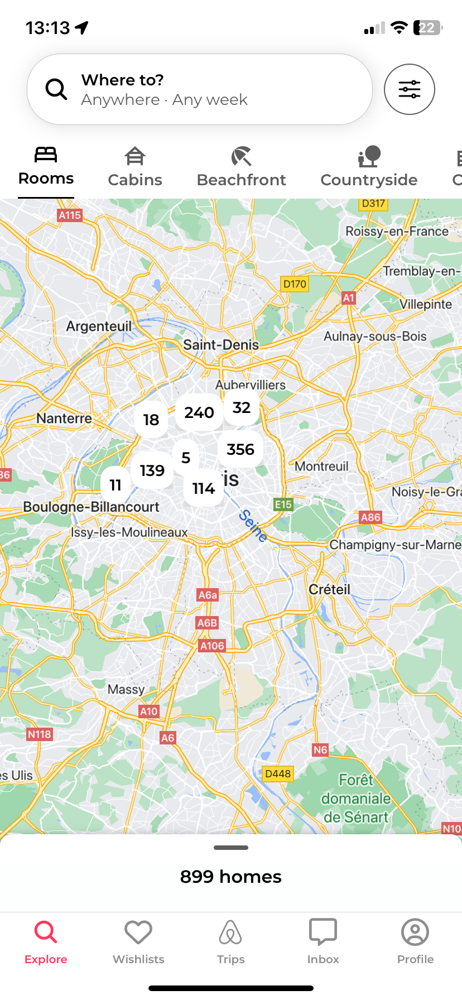
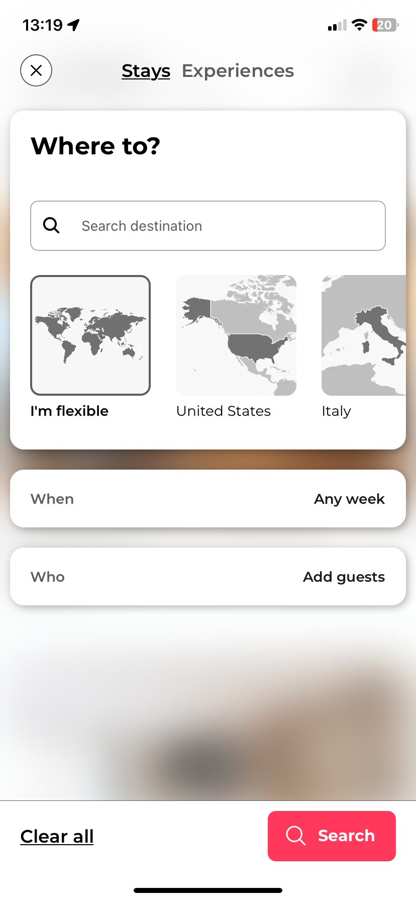

<div align="center">
    <h1>Airbnb clone</h1>


<p align="center">Airbnb clone app made using React Native and Clerk for authentication

</div>

Features:

- Apple authentication with [Clerk](https://clerk.com/)
- [Reanimated](https://docs.swmansion.com/react-native-reanimated/) for animations
- A map view of all of the available listings
- Share listings using the OS share sheet

# 📸 Screenshots

<div style="display: flex; flex-wrap: wrap; gap: 10px; margin-bottom: 20px">
    
    
    
    
    
    
</div>

# ⚙️ How to Run

1. **Clone the repository:**

   ```
   git clone https://github.com/xtommas/airbnb-rn.git
   ```

2. **Navigate to the project directory:**

   ```
   cd airbnb-rn
   ```

3. **Install dependencies:**

   ```
   npm install
   ```

4. **Start Expo:**

   ```
   npx expo start
   ```

5. **Scan the QR Code:**

   - Open the Expo Go app on your iOS or Android device.
   - Scan the QR code displayed in the terminal.
   - Wait for the app to load on your device.
